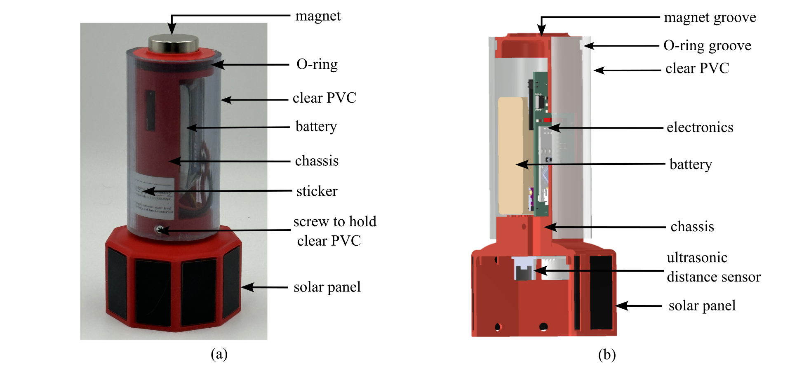
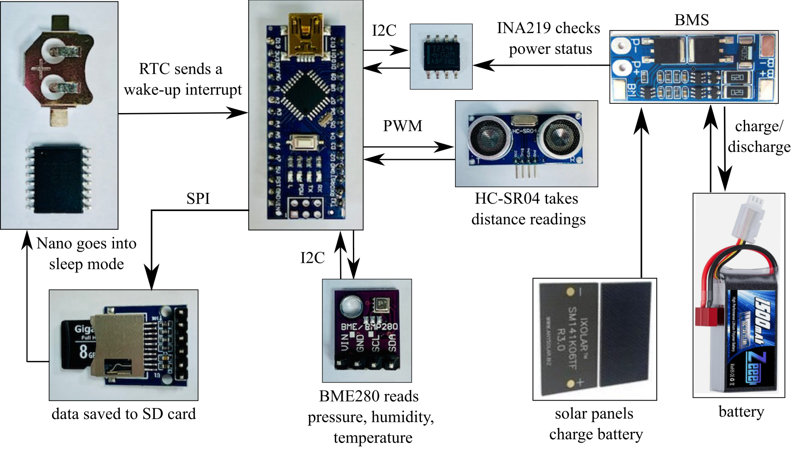
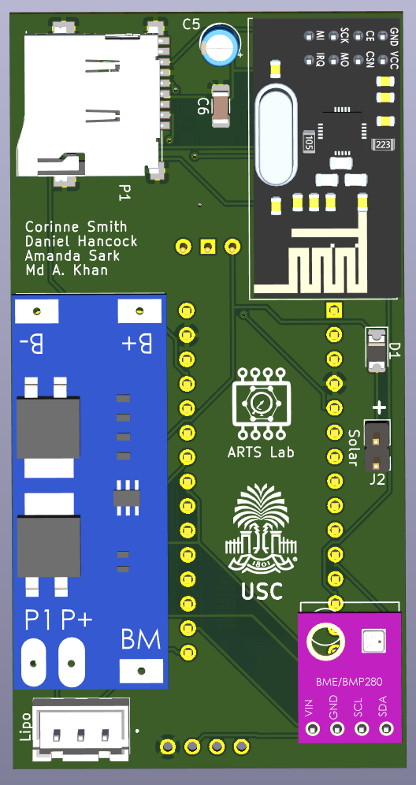

# UAV Rapidly-Deployable Stage Sensor with Permanent Magnet Docking Mechanism for Flood Monitoring in Undersampled Watersheds
## Deployment note
* Do not plug or unplug the SD card while power is on. Swtich must be turned to the off position to plug/unplug the SD card. 
## Fully assembled sensor package

## System diagram

## V0.5 PCB Top side

## V0.5 PCB Bottom side

