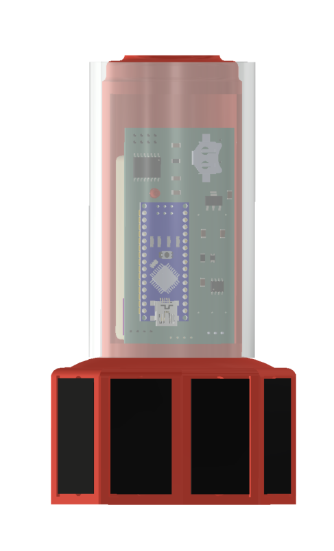
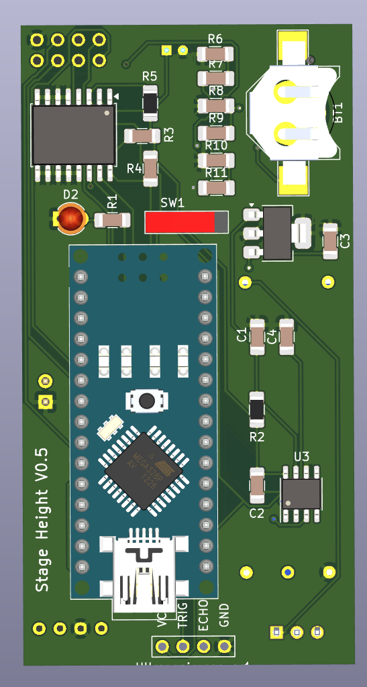

# UAV Rapidly-Deployable Stage Sensor with Permanent Magnet Docking Mechanism for Flood Monitoring in Undersampled Watersheds

##Fully assembled sensor package

##V0.5 PCB Top side

##V0.5 PCB Bottom side

